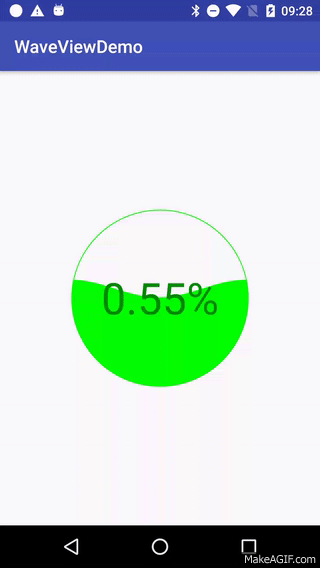

# WaveViewDemo
Android实现水波纹效果Demo

# 支持属性
<table>
    <tr>
        <td>Name</td>
        <td>Format</td>
        <td>说明</td>
        <td>使用方式</td>
    </tr>
    <tr>
        <td>borderColor</td>
        <td>color</td>
        <td>圆边线颜色</td>
        <td>app:borderColor="@color/border_color"</td>
    </tr>
    <tr>
        <td>waveColor</td>
        <td>color</td>
        <td>水波纹颜色</td>
        <td>app:waveColor="@color/wave_color"</td>
    </tr>
    <tr>
        <td>textColor</td>
        <td>color</td>
        <td>进度文本颜色</td>
        <td>app:textColor="@color/text_color"</td>
    </tr>
    <tr>
        <td>progress</td>
        <td>float</td>
        <td>当前进度</td>
        <td>app:progress="0"</td>
    </tr>
    <tr>
        <td>maxProgress</td>
        <td>float</td>
        <td>最大进度</td>
        <td>app:textColor="100"</td>
    </tr>
</table>